# mart City Infrastructure: Демонстрация паттернов проектирования
Этот проект представляет собой комплексную реализацию различных паттернов проектирования в контексте инфраструктуры «умного города». Здесь показано, как порождающие, структурные и поведенческие паттерны могут сочетаться для создания гибкой, поддерживаемой и масштабируемой системы.

## Структура проекта
Код разделён на три основные категории паттернов:

```mermaid
graph TD
    %% ==================== Creational ====================
    subgraph Creational
        Logger(Logger.cs)
        ConfigManager(ConfigManager.cs)
        IDevice(IDevice.cs)
        Drone(Drone.cs)
        Camera(Camera.cs)
        DeviceFactory(DeviceFactory.cs)
        DroneFactory(DroneFactory.cs)
        CameraFactory(CameraFactory.cs)
        ITransport(ITransport.cs)
        Bus(Bus.cs)
        IController(IController.cs)
        StandardController(StandardController.cs)
        ISensor(ISensor.cs)
        TemperatureSensor(TemperatureSensor.cs)
        ICityInfrastructureFactory(ICityInfrastructureFactory.cs)
        CityAFactory(CityAFactory.cs)
        Building(Building.cs)
        BuildingBuilder(BuildingBuilder.cs)
        DevicePrototype(DevicePrototype.cs)
        ConfigurableDevice(ConfigurableDevice.cs)
    end

    DroneFactory -->|создаёт| Drone
    DroneFactory -->|наследует| DeviceFactory
    CameraFactory -->|создаёт| Camera
    CameraFactory -->|наследует| DeviceFactory
    Drone -.->|реализует| IDevice
    Camera -.->|реализует| IDevice

    CityAFactory -.->|реализует| ICityInfrastructureFactory
    CityAFactory -->|создаёт| Bus
    CityAFactory -->|создаёт| StandardController
    CityAFactory -->|создаёт| TemperatureSensor
    Bus -.->|реализует| ITransport
    StandardController -.->|реализует| IController
    TemperatureSensor -.->|реализует| ISensor

    BuildingBuilder -->|строит| Building
    ConfigurableDevice -->|наследует| DevicePrototype

    Logger -->|используется многими| Creational
    ConfigManager -->|используется| Creational

    %% ==================== Structural ====================
    subgraph Structural
        INewCamera(INewCamera.cs)
        OldCamera(OldCamera.cs)
        CameraAdapter(CameraAdapter.cs)
        IControlMode(IControlMode.cs)
        LocalControl(LocalControl.cs)
        RemoteControl(RemoteControl.cs)
        DeviceBridge(DeviceBridge.cs)
        SmartLight(SmartLight.cs)
        ICityComponent(ICityComponent.cs)
        City(City.cs)
        District(District.cs)
        SimpleBuilding(SimpleBuilding.cs)
        IService(IService.cs)
        AnalyticsService(AnalyticsService.cs)
        ServiceDecorator(ServiceDecorator.cs)
        LoggingDecorator(LoggingDecorator.cs)
        CityFacade(CityFacade.cs)
        SensorType(SensorType.cs)
        SensorTypeFactory(SensorTypeFactory.cs)
        IDeviceAccess(IDeviceAccess.cs)
        RealDevice(RealDevice.cs)
        DeviceProxy(DeviceProxy.cs)
    end

    CameraAdapter -->|адаптирует| OldCamera
    CameraAdapter -.->|реализует| INewCamera

    SmartLight -->|наследует| DeviceBridge
    SmartLight -->|использует| IControlMode
    LocalControl -.->|реализует| IControlMode
    RemoteControl -.->|реализует| IControlMode

    City -->|содержит| District
    District -->|содержит| SimpleBuilding
    City -.->|реализует| ICityComponent
    District -.->|реализует| ICityComponent
    SimpleBuilding -.->|реализует| ICityComponent

    LoggingDecorator -->|наследует| ServiceDecorator
    LoggingDecorator -->|оборачивает| IService
    AnalyticsService -.->|реализует| IService

    CityFacade -->|использует| Logger
    CityFacade -->|использует| ConfigManager

    SensorTypeFactory -->|создаёт| SensorType

    DeviceProxy -->|содержит| RealDevice
    DeviceProxy -.->|реализует| IDeviceAccess
    RealDevice -.->|реализует| IDeviceAccess

    %% ==================== Behavioral ====================
    subgraph Behavioral
        EventHandler(EventHandler.cs)
        ValidationHandler(ValidationHandler.cs)
        SecurityHandler(SecurityHandler.cs)
        ICommand(ICommand.cs)
        TurnOnLightCommand(TurnOnLightCommand.cs)
        SendDroneCommand(SendDroneCommand.cs)
        IExpression(IExpression.cs)
        Context(Context.cs)
        GreaterThanExpression(GreaterThanExpression.cs)
        DeviceCollection(DeviceCollection.cs)
        IMediator(IMediator.cs)
        EventMediator(EventMediator.cs)
        DeviceMemento(DeviceMemento.cs)
        DeviceOriginator(DeviceOriginator.cs)
        IObserver(IObserver.cs)
        SecurityService(SecurityService.cs)
        EventPublisher(EventPublisher.cs)
        DeviceState(DeviceState.cs)
        OnState(OnState.cs)
        OffState(OffState.cs)
        DeviceContext(DeviceContext.cs)
        IRoutingStrategy(IRoutingStrategy.cs)
        FastestRoute(FastestRoute.cs)
        ShortestRoute(ShortestRoute.cs)
        Navigator(Navigator.cs)
        EventProcessor(EventProcessor.cs)
        FireEventProcessor(FireEventProcessor.cs)
        IVisitor(IVisitor.cs)
        AuditVisitor(AuditVisitor.cs)
        IVisitable(IVisitable.cs)
        VisitableDrone(VisitableDrone.cs)
        IHandler(IHandler.cs)
        NullHandler(NullHandler.cs)
    end

    ValidationHandler -->|наследует| EventHandler
    SecurityHandler -->|наследует| EventHandler
    ValidationHandler -->|использует| Logger
    SecurityHandler -->|использует| Logger

    TurnOnLightCommand -.->|реализует| ICommand
    SendDroneCommand -.->|реализует| ICommand

    GreaterThanExpression -.->|реализует| IExpression

    DeviceCollection -->|содержит| IDevice

    EventMediator -.->|реализует| IMediator

    DeviceOriginator -->|создаёт| DeviceMemento
    DeviceOriginator -->|восстанавливает| DeviceMemento

    SecurityService -.->|реализует| IObserver
    EventPublisher -->|управляет| IObserver

    OnState -->|наследует| DeviceState
    OffState -->|наследует| DeviceState
    DeviceContext -->|использует| DeviceState

    FastestRoute -.->|реализует| IRoutingStrategy
    ShortestRoute -.->|реализует| IRoutingStrategy
    Navigator -->|использует| IRoutingStrategy

    FireEventProcessor -->|наследует| EventProcessor
    FireEventProcessor -->|вызывает| Logger

    AuditVisitor -.->|реализует| IVisitor
    VisitableDrone -->|наследует| Drone
    VisitableDrone -.->|реализует| IVisitable

    NullHandler -.->|реализует| IHandler

    %% ==================== Program ====================
    Program(Program.cs)
    Program -->|использует| Logger
    Program -->|использует| ConfigManager
    Program -->|использует| DroneFactory
    Program -->|использует| CameraFactory
    Program -->|использует| CityAFactory
    Program -->|использует| BuildingBuilder
    Program -->|использует| ConfigurableDevice
    Program -->|использует| CameraAdapter
    Program -->|использует| SmartLight
    Program -->|использует| City
    Program -->|использует| LoggingDecorator
    Program -->|использует| CityFacade
    Program -->|использует| SensorTypeFactory
    Program -->|использует| DeviceProxy
    Program -->|использует| ValidationHandler
    Program -->|использует| SecurityHandler
    Program -->|использует| TurnOnLightCommand
    Program -->|использует| GreaterThanExpression
    Program -->|использует| DeviceCollection
    Program -->|использует| EventMediator
    Program -->|использует| DeviceOriginator
    Program -->|использует| EventPublisher
    Program -->|использует| SecurityService
    Program -->|использует| DeviceContext
    Program -->|использует| OnState
    Program -->|использует| OffState
    Program -->|использует| Navigator
    Program -->|использует| FastestRoute
    Program -->|использует| FireEventProcessor
    Program -->|использует| VisitableDrone
    Program -->|использует| AuditVisitor
    Program -->|использует| NullHandler
```

Порождающие (Creational) – отвечают за создание объектов.

Структурные (Structural) – обеспечивают построение сложных структур из классов и объектов.

Поведенческие (Behavioral) – управляют взаимодействием и распределением обязанностей между объектами.

Каждый паттерн реализован в виде набора классов с явно выраженными связями. Точка входа – Program.cs – демонстрирует совместную работу всех компонентов.

## Используемые паттерны проектирования
Порождающие
Абстрактная фабрика – DeviceFactory, CityAFactory

Фабричный метод – DroneFactory, CameraFactory

Строитель – BuildingBuilder

Прототип – DevicePrototype, ConfigurableDevice

Одиночка – Logger, ConfigManager (неявно используется повсеместно)

Структурные
Адаптер – CameraAdapter

Мост – DeviceBridge, SmartLight, IControlMode

Компоновщик – City, District, SimpleBuilding

Декоратор – ServiceDecorator, LoggingDecorator

Фасад – CityFacade

Заместитель – DeviceProxy, RealDevice

Поведенческие
Цепочка обязанностей – EventHandler, ValidationHandler, SecurityHandler

Команда – ICommand, TurnOnLightCommand, SendDroneCommand

Интерпретатор – IExpression, GreaterThanExpression

Итератор – DeviceCollection (реализован неявно)

Посредник – IMediator, EventMediator

Хранитель – DeviceMemento, DeviceOriginator

Наблюдатель – IObserver, SecurityService, EventPublisher

Состояние – DeviceState, OnState, OffState, DeviceContext

Стратегия – IRoutingStrategy, FastestRoute, ShortestRoute, Navigator

Шаблонный метод – EventProcessor, FireEventProcessor

Посетитель – IVisitor, AuditVisitor, IVisitable, VisitableDrone

Пустой объект – NullHandler

